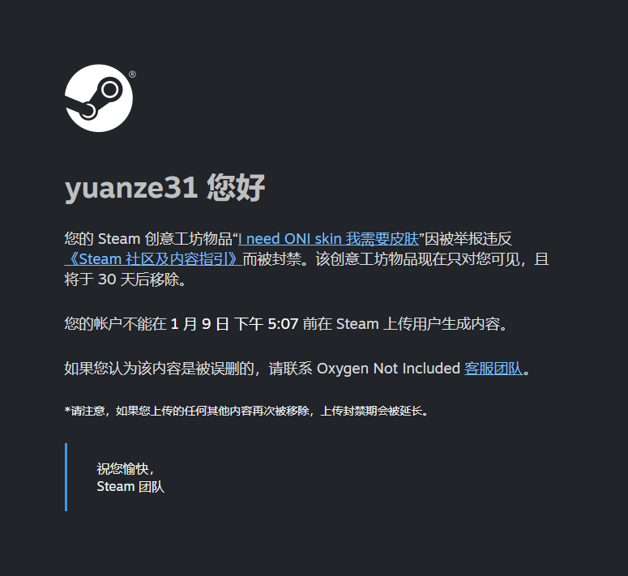

# 缺氧皮肤破解

## **说明**

**只能实现在本地游玩时可使用全部皮肤的效果，并不能修改科雷服务器中的数据**  看起来 KELI 非常“享受”强迫玩家使用他们“精心构建”的皮肤系统，单纯出于恶心玩家的目的，而不是出于商业利益

**声明**：本模组仅供学习交流，严禁用于商业用途，使用时请遵守当地法律法规，由于不正当使用产生的法律问题与本人无关

## **使用方法**

1. 从[Releases](https://github.com/yuanze31/I_need_ONI_skin/releases)下载 I_need_ONI_skin.zip
2. 解压到 C:\Users\[Your Username]\Documents\Klei\OxygenNotIncluded\mods\local 文件夹下，此时文件夹结构应为

```
-./local
  |-I_need_ONI_skin
    |-I_need_ONI_skin.dll
    |-mod.yaml
    |-mod_info.yaml
```

3. 在游戏中以通常的方式启用本模组即可

---

# 以下是旧版说明，仅保留供参考，不作任何内容解释或质量保障

---

## **使用方法**

目前适用于 **U54-646843** 版本

### 方法 1（推荐）

在创意工坊订阅同功能[mod](https://steamcommunity.com/sharedfiles/filedetails/?id=3383541990)

### 方法 2

在[Releases](https://github.com/yuanze31/I_need_ONI_skin/releases)中下载 Assembly-CSharp.dll，并替换位于 **.\SteamLibrary\steamapps\common\OxygenNotIncluded\OxygenNotIncluded_Data\Managed** 的 **Assembly-CSharp.dll**

**注意：**

1. 每次更新/验证游戏完整性后需要重新替换（仅限方法 2）
2. 从 U52-622509 版本后，破解规则为将未拥有的更改为 1 个，拥有多个的数量不变，从而方便筛选 **_2+_** 拆解
3. **严禁**随意拆解只拥有一个的皮肤，你可能根本没有这个皮肤，从而导致向科雷服务器发送许多错误信息，目前对科雷账号的影响未知，**如有尝试，后果自负**

## **破解教程**

使用[dnSpy](https://github.com/dnSpy/dnSpy)打开 **.\SteamLibrary\steamapps\common\OxygenNotIncluded\OxygenNotIncluded_Data\Managed\Assembly-CSharp.dll**

搜索 **PermitItems.GetOwnedCount**

找到类似以下内容

```C#
public static int GetOwnedCount(PermitResource permit)
{
	int result = 0;
	PermitItems.ItemInfo itemInfo;
	if (PermitItems.Mappings.TryGetValue(permit.Id, out itemInfo))
	{
		result = KleiItems.GetOwnedItemCount(itemInfo.ItemType);
	}
	return result;
}
```

将其改为

```C#
public static int GetOwnedCount(PermitResource permit)
{
	int result = 0;
	PermitItems.ItemInfo itemInfo;
	if (PermitItems.Mappings.TryGetValue(permit.Id, out itemInfo))
	{
		result = KleiItems.GetOwnedItemCount(itemInfo.ItemType);
	}
	return result + 1;
}
```

即 **return result;** 改为 **return result + 1;** 保存并重启游戏即可生效
